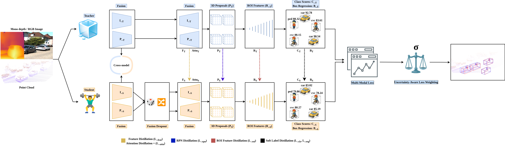

# 3D-AWARE
Knowledge Distillation with Adaptive Representation Encoding for Multi-Modal 3D Object Detection


---


## Method Overview



---

# 🖥️ Environment Setup

- Linux (tested on Ubuntu 22.04) (GPU 3080TI, 3090TI)
- Python 3.8
- PyTorch 1.10 + CUDA 11.3

---

# ⚙️ Installation
1.To deploy this project, run:
```
git clone [https://github.com/faziii0/3D-AWARE]
cd 3D-AWARE
```
---
2.Create New Environment using Anaconda or Python
```
conda create -n luminet python=3.8
conda activate luminet

conda install pytorch=1.10.0 torchvision=0.11.0 torchaudio=0.10.0 cudatoolkit=11.3 -c pytorch -c conda-forge
conda install -c conda-forge cudatoolkit-dev
pip install -r requirements.txt
```
---
3.Check CUDA availability.
```
python -c "import torch; print(torch.cuda.is_available())"
```
---
4.Build and install the  libraries
```
sh build_and_install.sh
```
---
# Depth Images
We use [MiDaS](https://github.com/isl-org/MiDaS) pretrained model to covert image_2 into depth images or download it from here Google. You can clone their repo and run this command
```
python run.py --model_type dpt_beit_large_512 --input_path image_2 --output_path depth
```
---
You can also download depth images from google drive
```
wget https://drive.google.com/file/d/1PT-5CQcIerkGnN_dJLI-ml5O8ectMfgf/view?usp=drive_link
```
---

# 📚 Dataset Preparation

Please download the official [KITTI 3D object detection](https://www.cvlibs.net/datasets/kitti/eval_object.php?obj_benchmark=3d) dataset and  train mask from [Epnet++](https://github.com/happinesslz/EPNetV2)
```

# 📦 Teacher Weights
```
wget https://drive.google.com/file/d/1toB6OvOaEQ8RHjGEMCGABpXe5rnCYLrT/view?usp=sharing
```

3D-AWARE
├── data
│   ├── KITTI
│   │   ├── ImageSets
│   │   ├── object
│   │   │   ├── training
│   │   │   │   ├── calib
│   │   │   │   ├── velodyne
│   │   │   │   ├── label_2
│   │   │   │   ├── image_2
│   │   │   │   ├── mono_depth
│   │   │   │   ├── train_mask
│   │   │   ├── testing
│   │   │   │   ├── calib
│   │   │   │   ├── velodyne
│   │   │   │   ├── image_2
│   │   │   │   ├── mono_depth
├── lib
├── pointdep_lirad
├── tools

```

---

# 📊 Trained Model Evaluation


| Task                  | Easy   | Moderate | Hard   |
| :-------------------- | :----- | :------- | :----- |
| Car (Detection)       | 98.69% | 95.52%   | 92.93% |
| Car (Orientation)     | 98.68% | 95.40%   | 92.74% |
| Car (3D Detection)    | 91.38% | 84.85%   | 80.39% |
| Car (Bird Eye View)   | 95.54% | 91.60%   | 88.95% |


## Acknowledgements

 Thanks to all the contributors and authors of the project [PointRCNN](https://github.com/sshaoshuai/PointRCNN), [EPNet++](https://github.com/happinesslz/EPNetV2), [EPNet](https://github.com/happinesslz/EPNet),[MiDaS](https://github.com/isl-org/MiDaS)

## Citation
---

```bibtex
@article{liu2022epnet++,
  title={EPNet++: Cascade bi-directional fusion for multi-modal 3D object detection},
  author={Liu, Zhe and Huang, Tengteng and Li, Bingling and Chen, Xiwu and Wang, Xi and Bai, Xiang},
  journal={IEEE Transactions on Pattern Analysis and Machine Intelligence},
  year={2022},
  publisher={IEEE}
}

@article{Huang2020EPNetEP,
  title={EPNet: Enhancing Point Features with Image Semantics for 3D Object Detection},
  author={Tengteng Huang and Zhe Liu and Xiwu Chen and Xiang Bai},
  booktitle ={ECCV},
  month = {July},
  year={2020}
}

@InProceedings{Shi_2019_CVPR,
    author = {Shi, Shaoshuai and Wang, Xiaogang and Li, Hongsheng},
    title = {PointRCNN: 3D Object Proposal Generation and Detection From Point Cloud},
    booktitle = {The IEEE Conference on Computer Vision and Pattern Recognition (CVPR)},
    month = {June},
    year = {2019}
}
